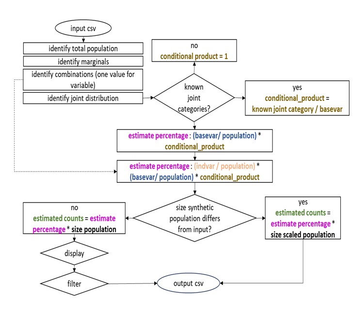

<div align="center" style="background-color:white; padding:10px; display:inline-block;">
  
</div>


# IPF_multidim
Multidimensionality of IPF, project FOSSR (WP5.5 Synthetic Populations Generator)

Data from [opensalutelazio](https://www.opensalutelazio.it/salute/stato_salute.php?stato_salute) Data concern the resident population and the cases of illness out of the residential population. So the resident population is the reference for the synthetic population

Goal: synthetic data for intersectionality disease and sociodemographic.

Algorithm in ```multidim.py``` to implement multiple iterative proportional fitting

* Socio-demographics:
   + Gender, 2 categories (M,F)
   + Age, 3 categories (A1: 00-29, A2: 30-59, A3: 60-100): here they are clustered in these ranges, the original dataset is from 00-04 to 85-100 in steps of 5
     
* Incidence disease (chosen because of different distribution):
   + Hypertension, 2 categories (HPT, NHT): cases of no hypertension are computed taking the reference level (total cases, male population, female population and substracting the case of hypertension)
   + Heart failure, 2 categories (HF, NHF): cases of no hearth failure are computed taking the reference level (total cases, male population, female population and substracting the case of hearth failure)

Reproducing joint categories age (age30,age3060,age60100) * gender (male, female) * hpt (hptyes, hptno) * hf (hfyes, hfno)

## Handling input file

Data to be integrated are in `input_file_tuples.csv`. The file uses a tuple-based format where each row represents a population constraint across different dimensions:

**Format:**
# Flowchart of the service

<div align="center" style="background-color:white; padding:10px; display:inline-block;">
  
</div>

# How it works

```csv
gender;age;hpt;hf;value
male;;;;3073047
female;;;;3259977
;30;;;1745215
;3060;;;2832088
;60100;;;1755721
;;yes;;1193445
;;no;;5139579
;;;yes;93926
;;;no;6239098
;30;yes;;3547
;3060;yes;;252543
;60100;yes;;937355
```

**Structure:**

* **Dimension columns** (gender, age, hpt, hf): Each column represents a dimension/variable
* **Empty cells**: Indicate that dimension is not constrained in that row
* **Single non-empty cell**: Represents a marginal distribution (e.g., `male;;;;3073047` = 3,073,047 males)
* **Multiple non-empty cells**: Represents a joint distribution (e.g., `;30;yes;;3547` = 3,547 people aged 30 with hypertension)
* **value**: The count for that constraint

**Assumptions:**

* Estimates assume data derive from the same population (i.e., the sum of categories for each variable should match the total population)
* Total population used for normalization is taken as the sum of the first complete marginal distribution
* Computation is possible even if totals don't perfectly match, but at the cost of estimation error

## How to use it

0. Download from GitHub repository:
   * Code > Download .zip file or open with GitHub Desktop
   * alternatively, from cmd line:
 ```bash
git clone https://github.com/RoccoPaolillo/IPF_multidim.git
 ```

### Installation

1. Create a virtual environment:

   ```bash
   python3 -m venv venv
   source venv/bin/activate  # On macOS/Linux
   ```

2. Install dependencies:

   ```bash
   pip install pandas
   ```

### Running the script

The script accepts command-line arguments for input, output, and filtering:

#### Command-line Usage

```bash
# Show help and usage information
python synthpopgen.py --help

# Generate full synthetic population (all combinations) to stdout
python synthpopgen.py -i input_file_tuples.csv -f all

# Generate full synthetic population and save to file
python synthpopgen.py -i input_file_tuples.csv -f all -o output.csv

# Filter for age=30, hpt=no, hf=no (any gender) and print to stdout
python synthpopgen.py -i input_file_tuples.csv -f "age:30,hpt:no,hf:no"

# Filter for female, age=60-100, hpt=yes (any hf) and save to file
python synthpopgen.py -i input_file_tuples.csv -f "gender:female,age:60100,hpt:yes" -o results.csv

# Filter for males only (all other dimensions "any")
python synthpopgen.py -i input_file_tuples.csv -f "gender:male"
```

#### Command-line Arguments

* `-i, --input` (required): Input CSV file in tuple format
* `-o, --output` (optional): Output CSV file. If not specified, results are printed to stdout
* `-f, --filter` (optional): Filter specification (defaults to "all" if not specified)
  * Use `"all"` to generate the full synthetic population with all combinations
  * Use `"dimension:value"` pairs separated by commas to filter specific dimensions
  * Omitted dimensions default to "any" (all values for that dimension)
* `-d, --display` (optional): Display mode for filtered results (defaults to "split" if not specified)
  * `"split"` (default): Shows all combinations of unspecified dimensions as separate rows
  * `"aggregate"`: Sums values across unspecified dimensions into a single aggregated row
  * Only affects filtered output; ignored when `-f all` is used
* `--validate` (optional) to print validation measure in a separate csv for RMSE (Root Mean Squared Error) and a separate csv for APE (Average Percentage Error). It works only if -f all option is used
   
#### Filter Examples

```bash
# Full population - all combinations of all dimensions
python synthpopgen.py -i input.csv -f "all"

# Single dimension filter - all ages for males
python synthpopgen.py -i input.csv -f "gender:male"

# Multiple dimension filter - specific age and health conditions
python synthpopgen.py -i input.csv -f "age:30,hpt:no,hf:no"

# Partial filter - female, age 60-100, any hpt/hf status
python synthpopgen.py -i input.csv -f "gender:female,age:60100"
```

#### Display Mode Examples

The `-d/--display` parameter controls how unspecified dimensions are shown in the output:

**Split mode (default)** - Shows all combinations:

```bash
python synthpopgen.py -i input.csv -f "gender:male,age:30,hf:yes" -d split
# Output:
# gender;age;hpt;hf;value
# male;30;yes;yes;0
# male;30;no;yes;205
```

**Aggregate mode** - Sums into a single row:

```bash
python synthpopgen.py -i input.csv -f "gender:male,age:30,hf:yes" -d aggregate
# Output:
# gender;age;hpt;hf;value
# male;30;;yes;205
```

Note how in aggregate mode, the unspecified dimension (`hpt`) is shown as empty, and the value is the sum of all combinations (0 + 205 = 205).

**More complex example** with two unspecified dimensions:

```bash
# Split mode: 4 rows (2 hpt values × 2 hf values)
python synthpopgen.py -i input.csv -f "gender:male,age:30" -d split
# Output:
# male;30;yes;yes;0
# male;30;yes;no;1721
# male;30;no;yes;205
# male;30;no;no;844925

# Aggregate mode: 1 row (sum of all 4 combinations)
python synthpopgen.py -i input.csv -f "gender:male,age:30" -d aggregate
# Output:
# male;30;;;846851
```

### Output Format

The script outputs results in the same tuple format as the input file (semicolon-delimited):

```csv
gender;age;hpt;hf;value
male;30;yes;yes;0
male;30;yes;no;430
male;30;no;yes;51
male;30;no;no;211231
```

**Behavior:**

* When using `-f all`: Generates all possible combinations of dimensions
* When filtering with `-d split` (default): Returns all rows matching the filter criteria, showing all combinations of unspecified dimensions
* When filtering with `-d aggregate`: Returns a single row with summed values across unspecified dimensions (shown as empty cells)
* Each row represents one combination (or aggregate) with its estimated population count
* Output can be redirected to a file using `-o` or printed to stdout


If metrics of validation want to be reported
```bash
python synthpopgen.py -i report_validation/input_no_agexhpt.csv -f all -o output.csv --validate validation.csv
```
It will report one csv with output, one *_RMSE.csv with RMSE global mease, *_APE.csv with average percentage error for each constraint identified.

It works only on -f all option and printed .csv results

